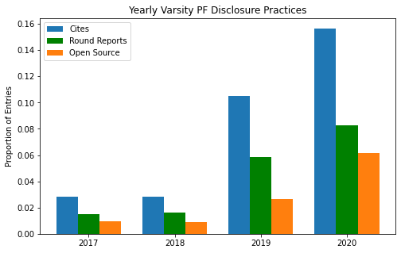

# Disclosure in 5 Charts

By Peter Zhang

#### Introduction

I fondly recall my first outround. The round was scheduled to start 20 minutes after pairings were posted; Millburn AW did not have a wiki page. In response to the post/pre-fiat-hauntological-feminist-counterfactuals K-aff, I read a disclosure shell and presented reasons why military conscription was a bad policy. After a crushing defeat, I taught my opponent how to use the wiki. I left the tournament feeling satisfied.

It's hard to picture that scene playing out in 2021. Nowadays, my team's pre-round disclosure decisions chiefly concern how to best brush off pesky requests for our new aff's plan text or standard text. Over my debate career, disclosing full text has gone from unstrategic (because they'll have your cards!) to even more unstrategic (because they'll have your cards, and you'll still lose every round to o-source!).

How exactly did we get here? I wanted to find out, so—you guessed it—I gathered some data.

Before I dive in, I should mention my personal stances. I think disclosure is good. I also think open sourcing can be harmful (for research skills). I'm inclined to favor full text. You might disagree with me, and this article won't argue with you. Here, I merely want to present the state of disclosure.

#### Dataset

I scraped the wikis (during off-hours) of every season since 2015. Schools and teams with misformatted wiki pages (i.e. a handful of PF-ers) were omitted. I collected the round info, cite names, and round reports of each team's page.

I also collected Tabroom data on every LD bid tournament, with historical records reaching back as far as available. Tournaments that weren't hosted on Tabroom or didn't have entries pages were excluded. For the 295 remaining tournaments, I scraped the Novice, JV, and Varsity entries of LD, PF, and Policy. I made some judgement calls in categorizing these, but generally, novice divisions were explicitly labeled as such, or were open to middle schoolers. Varsity divisions were those with a TOC bid. JV divisions were those in between.[^1]

I matched teams and tournament using school and team names. The losses are moderate (think 10%-ish) but significant enough that you should treat the results with caution.

#### The Norm Setters

This season's debaters love reading disclosure theory. About a third of Varsity LD entries had a cite that mentioned disclosure (with one popular name being "disclose or lose"). One-third is huge compared to last season and the season before, when the proportioned seemed to plateau at around 20%. It must have to do with the online environment—e-debaters are probably more [engaged](https://www.vbriefly.com/2020/12/31/five-trends-among-e-debate-competitors-by-peter-zhang/), more tech savvy, and *much* less likely to just ask for the aff in person.

Of course, "disclose citations" isn't the biggest revolution since 2015. The real big changes were in all the other disclosure interps: open source, new affs bad, full-text, and round reports. Full-text was a fad in 2017, started to fade out, and abruptly disappeared this year; it seems to have been replaced by open source, which is now fairly popular. Round reports is still a fringe interp (as it should be). New affs bad, on the other hand, has grown exponentially: one in every seven debaters demands the plan text!

#### Norms Have Been Set

Ok, so there's more disclosure theory—have their efforts paid off?

Yes, and along every metric too. Well over half of all debaters have a disclosure page and the proportion has been growing each year. As we might have expect from the earlier chart, there was a sudden jump this season in cites of about 10%. Of those who post cites, the proportion who post round reports and open source has grown consistently over the period and now is at almost 90%.

This is quite remarkable! In 2015, less than 5% of debaters open-sourced. Now, over half do—strong evidence that disclosure norms are highly malleable.

#### Tournaments

Using Tabroom data, we can disaggregate these rates across tournaments from the 2019-2020 season. There turns out to be a ton of variation. Unsurprisingly, sparsely-attended finals bids have the lowest rates of disclosure (only 4 out of 63 competitors at Myers Park disclosed!). Meanwhile, large tournaments in California and Texas takes the sports for the best disclosure practices. 

The leading tournament Harvard-Westlake, is an interesting case study. One driving force behind their unusually high disclosure rates is that the invitation explicitly requires it. That wasn't always the case. Up until 2016, there was no mention of disclosure in the tournament [invite](https://www.tabroom.com/index/tourn/fields.mhtml?tourn_id=4169). In 2017, the [invite](https://www.tabroom.com/index/tourn/index.mhtml?webpage_id=2329&tourn_id=5792) required debaters to post cites. In 2018, the standard was [upgraded](https://www.tabroom.com/index/tourn/index.mhtml?webpage_id=4144&tourn_id=8649) to require open source. You can see these changes year-by-year: a big jump in cites in 2017, followed by more open sourcing in 2018 and 2019.

The requirement also applied to the novice division, and the increases here were enormous. The rate of open source nearly tripled from 2016 to 2017, although it has declined since. Make no mistake—these disclosure rates may be lower than those of varsity, but they are stellar compared to the rest of the circuit. You'll see that in a bit.

#### But What About the Children?

They are learning! From 2015 to 2020, the proportion of novices and JV entries that posted cites increased by six-fold. Meanwhile, the proportions that posted round reports and open sourced increased by eleven-fold and nineteen-fold, respectively.

Of course, the absolute proportion is still dismal. If you're in an average JV or novice division, there's about a 1-in-7 chance that your opponent discloses. Nonetheless, the trend is heartening. Teaching younger debaters to disclose well should improve the quality of debate at all levels and drive future increases in disclosure practices.

#### Putting the Public in PF

I overlooked PF-ers in my last post, so I'll acknowledge them here. Public Forum is at an exciting tipping point. As PF-ers have been importing arguments from LD and Policy, they have also been importing some disclosure practices. I'll showcase a few here.

These wiki pages are from my former high school teammates and they are fairly representative of the frontier in PF. These cites certainly aren't bad.

And when the cites *are* bad, they open source. I don't think posting rounds has caught on yet (it's certainly a hassle). It might be asking for too much, too soon.

Surely enough, the data bear out these trends. When the PF wiki went live in 2017, less than 0.25% of entries used it. Now, more Varsity PF debaters post cites than JV and Novice LD-ers, and the gap is growing quickly. An interesting thing to note is the prevalence of open source: whereas in LD there was a long lag before open source became the norm, it seems to have caught up pretty early on in PF.

If PF takes the route of LD, we can probably expect rapid growth over the next few years, with a lag in open source and round report expectations. That will be an interesting development to watch.

#### Thank You, Harvard-Westlake

To wrap up, I tallied the number of citations and open sourced documents contributed by each school from 2015 to 2021. These are the schools that provided the most help to bottom-feeders like myself in high school. Topping it off with both the most cites and the most docs is Harvard-Westlake. The leaderboard for most cites is followed by Strake, Harker, and Lexington. Just for fun, I included anyone with a "DebateDrills" cite under their own school; DebateDrills, very impressively, came in fifth. Thank you, prep fairies.

#### Limitations and Next Steps

The data I used were limited in several respects:

1. Tabroom data from several significant tournaments wasn't available, and especially so farther back. It also seems that larger tournaments switched to Tabroom earlier on, which may skew the results.
2. The tournaments examined were LD bid tournaments, which probably isn't representative of PF. It certainly would help if someone could collect Tabroom IDs for PF tournaments.
3. Lots of entries were lost in the matching process. If Tabroom said "Harvard-Westlake" and the wiki said "Harvard Westlake" (without the dash), then the entry and debater wouldn't be connected. A softer comparison (that tolerates errors) could likely to better.

Some cool follow-ups questions that this dataset could help answer include:

1. Are successful debaters more likely to disclose? Do they also disclose more?
2. Conversely, are debaters who refuse to disclose more likely to win, controlling for other factors?
3. What positions are being read? How does that change by location and over time?
4. Are certain positions less likely to be disclosed? (you know who I'm talking about)

Stay tuned.

[^1]: You can find my scraping tools and many more details about the scraping process on the [repo]().

